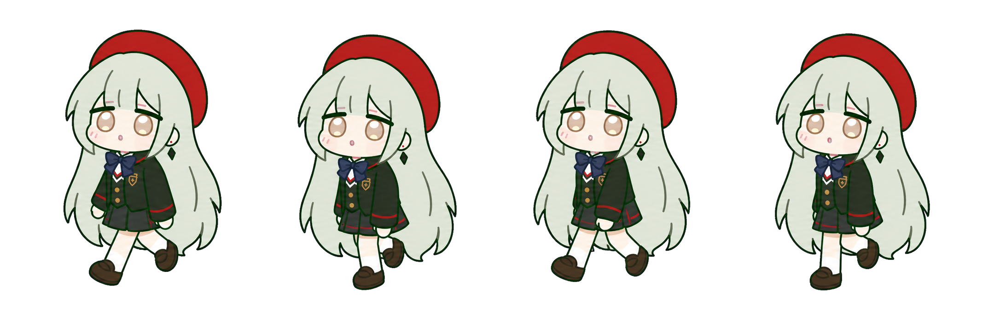
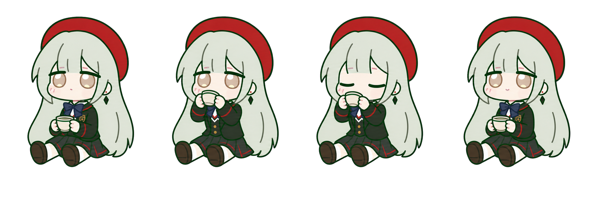
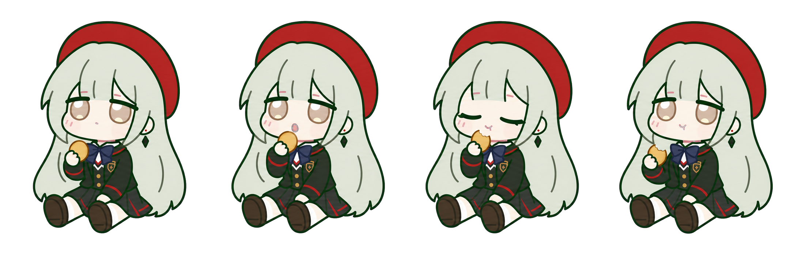

# MutsumiPet · 若叶睦桌宠

<p align="center">
  
</p>

一个使用 SwiftUI 制作的 macOS 透明桌宠。

[下载最新版 macOS 安装包](https://github.com/ianchiou28/MutsumiPet/releases/latest/download/MutsumiPet-macOS.zip) · 支持 macOS 13 及以上版本

应用图标采用马赛克瓷砖拼成的 Q 版若叶睦设计，并包含完整的 macOS 多尺寸 ICNS 资源。

## 动作预览

### 日常表情与互动

| 待机 | 疑惑 | 开心 |
|:---:|:---:|:---:|
|  |  |  |

| 睡觉 | 被抓起来 |
|:---:|:---:|
|  |  |

### 生活动作帧

**走路**



**喝茶**



**吃点心**



## 使用

- 点击若叶睦：切换表情与气泡。
- 拖动角色：睦会被拎起、悬空晃动，松手后软着陆。
- 待机时会在坐姿、疑惑、挥手与睡姿之间切换。
- 右键角色：切换置顶、气泡、尺寸或退出。
- 右键可选 60%–140% 尺寸，并在始终置顶、普通窗口、桌面后台之间切换。
- 自动换动作采用无过渡的离散切换，减少延迟和残影。
- 会在当前屏幕可用区域内自由散步，并随机喝茶、吃点心或停下来休息；三种生活动作均使用独立生成的四帧透明动画。
- 散步采用 60 Hz 平滑位移和距离驱动步态：每走过四分之一步幅才切换姿势，速度改变时步频会同步变化；角色抵达一次随机短距离目标后会立即恢复默认动作，拖拽也会立即打断移动。
- 每种动作都有 5–8 句专属预设台词，触发动作时会从对应台词组随机显示。
- 右键选择“让睦说一句”，会根据她当前的动作或表情立即说出对应台词。
- `Command-M`：互动；`Command-B`：显示或隐藏气泡。

运行：

```bash
./script/build_and_run.sh
```

要求 macOS 13 或更高版本。

## 开发与测试

```bash
swift test
./script/build_and_run.sh --verify
```

项目使用 Swift Package Manager，无第三方运行时依赖，所有动作与台词均完全离线运行。

## 许可证与声明

程序源码采用 [MIT License](LICENSE)。若叶睦角色及相关衍生图像素材不包含在 MIT 授权范围内，详见 [ASSET_NOTICE.md](ASSET_NOTICE.md)。本项目是非官方粉丝项目，与角色相关权利方无隶属或背书关系。
